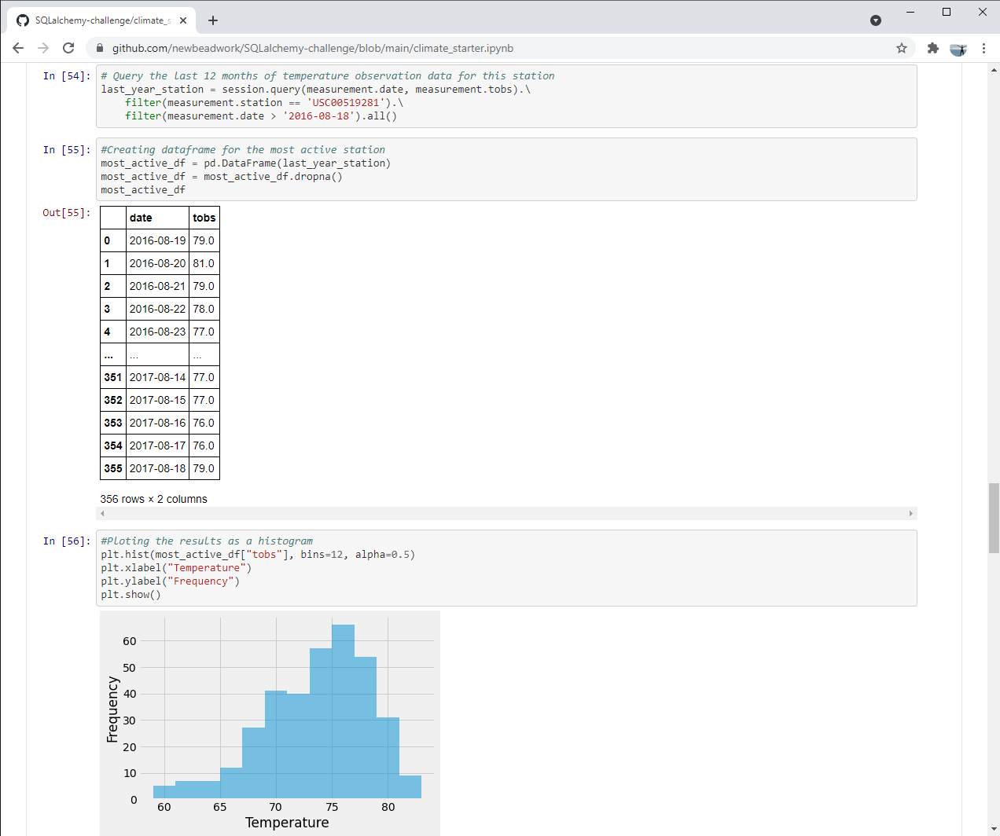
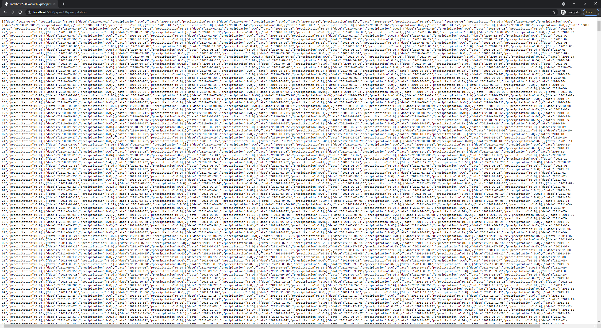

# Climate Analysis for Hawaii vacation trip with SQLAlchemy and Flask

Showcases (homework assighnment for Data Analytics Boorcamp) a basic understanding of SQLAlchemy, Sqlite, Pandas, Matplotlib, Flask and JSON.

The project includes:

- Climate Analysis and Exploration;

- Precipitation Analysis, including summary statistics;

- Station Analysis;

- Creating Flask API with JSON converted values;

- Calculation of the average temperature in June and in December at all stations across all available years in the dataset; 

- Using the t-test to determine whether the difference in the means, if any, is statistically significant;

- Calculation and ploting the min, avg, and max temperatures for the "vacation" your trip using the matching dates from the previous year;

- Calculation of the rainfall per weather station using the previous year's matching dates;

- Calculation of the daily normals. Normals are the averages for the min, avg, and max temperatures.

